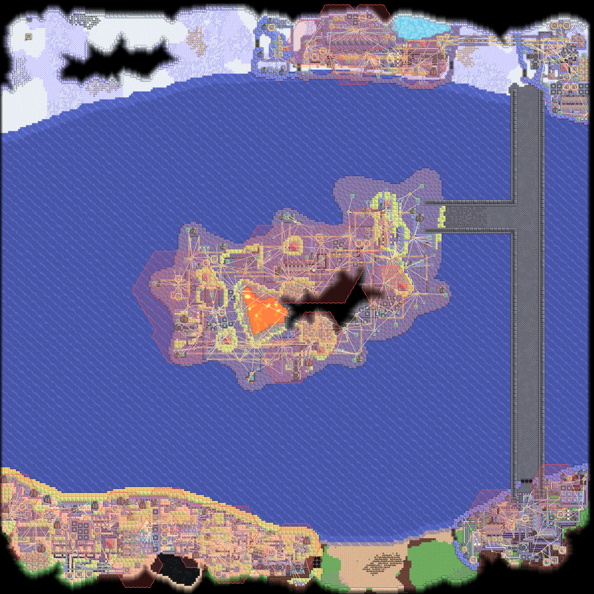
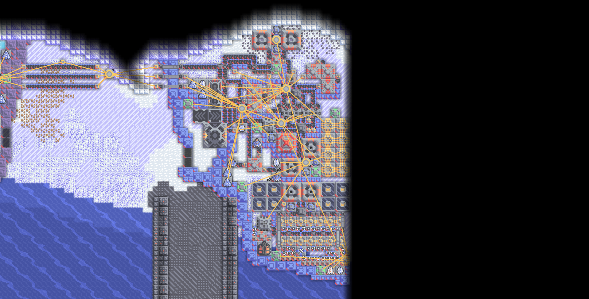
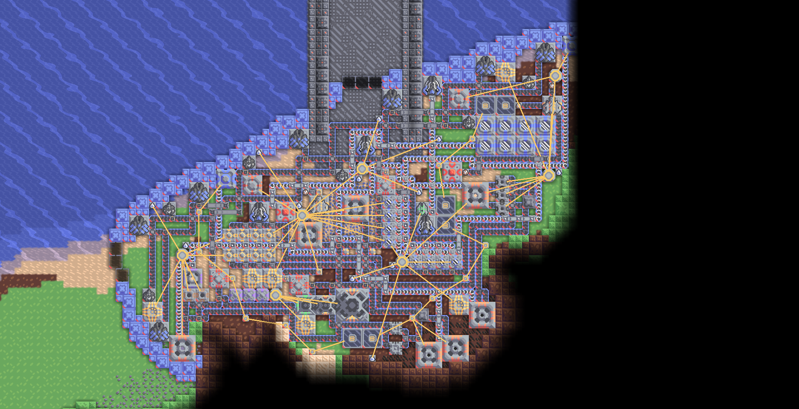
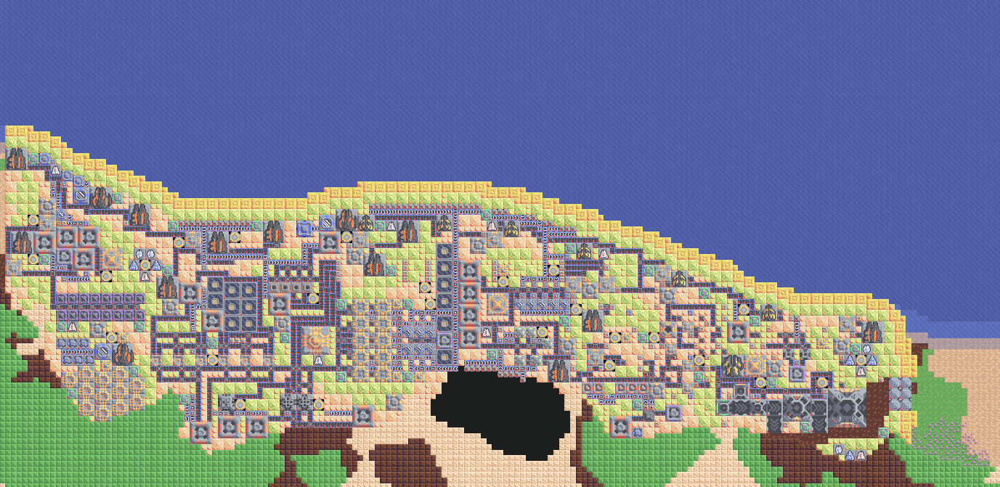
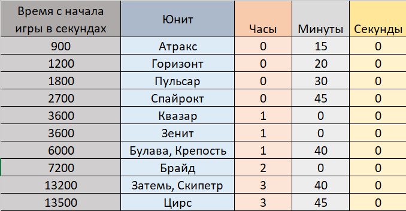
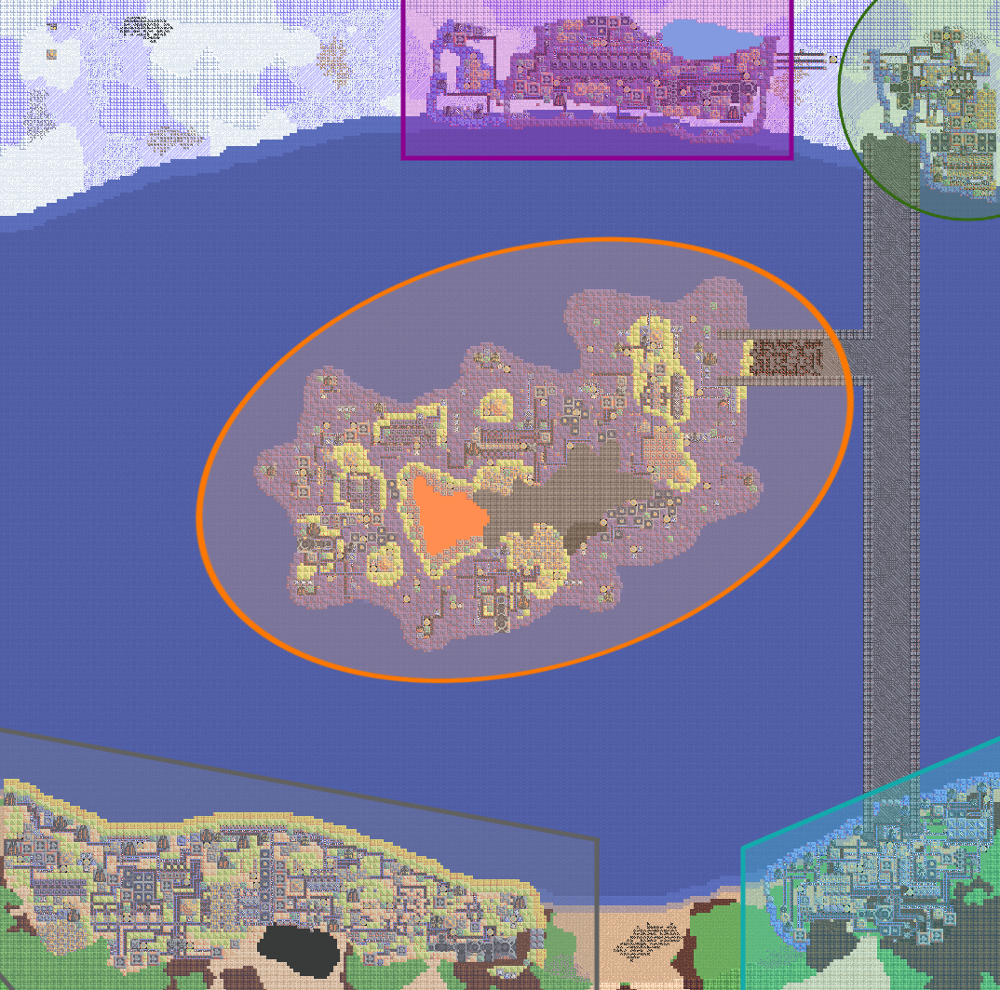

# Карта "Siberia and Greece"

## Описание

- Карта была разработана для игрового режима "Атака". Её размеры составляют 300x300 тайлов. Ландшафт и строения соответствуют планете Серпуло. Большая часть карты затоплена. На карте есть два берега: верхний, где находится ядро игроков, и нижний. Между ними расположен большой остров. Вся суша соединена мостами.
- По сюжету вас отправляют на миссию по уничтожению баз конкурентов. У вас есть достаточно ресурсов для постройки оборонительных сооружений. Через определённое время после старта игры активируются фабрики и реконструкторы на базах противников.
- Не стоит задерживаться на одном месте, необходимо постепенно уничтожать вражеские базы. Захваченные территории открывают доступ к новым ресурсам. Всего на карте расположено 5 баз. Победа достигается уничтожением всех 16 вражеских ядер.
- Описание карты, которое отображается в редакторе карт игры, также можно посмотреть в текстовом файле [Описание карты.txt](Описание карты.txt).

## Обзор вражеских баз

### Фабрика кошмаров

Эта база является самой близкой к ядру игроков. Она имеет три ядра. Здесь производятся юниты "Атракс" и "Спайрокт". Уничтожив самое левое ядро, можно получить доступ к добыче титана. Важными ресурсами этой базы также являются торий и озеро с криогенной жидкостью. После захвата территории здесь удобно размещать ториевые реакторы.

### Последний рубеж

Несмотря на своё название, это одна из самых простых баз для уничтожения и захвата. На базе всего одно ядро. Вся электроэнергетика поддерживается паровыми генераторами, работающими на угле. Если поджечь что-то на базе, последствия будут масштабными. Эта база не является самостоятельной и получает ресурсы от соседней базы. Здесь выпускаются юниты "Пульсар" и "Квазар". Производство этих юнитов можно легко прервать, разрушив линии конвейеров между базами.

### Криогенная крепость

Название этой базы полностью оправдано. Здесь производится большое количество криогенной жидкости, которая будет использоваться против вас, если вы нападёте на базу. На базе ведётся масштабная добыча титана, который служит боеприпасом для туррелей "Взрыватель". Также здесь производится метастекло и кремний, используемые в туррелях "Рассеиватель" и "Град". В отличие от других баз, на этой нет ремонтных станций — их функции выполняют юниты "Мега". Три процессора управляют их поведением:

- Первый процессор не позволяет юнитам покинуть территорию базы.
- Второй процессор заставляет юниты чинить повреждённые строения на базе.
- Третий процессор контролирует здоровье юнитов и отправляет их на ремонтную турель, если они получили повреждения.

### Вулканический остров

Это самая большая и укреплённая база на карте. Электричество здесь вырабатывается в больших количествах благодаря термальным генераторам. База оснащена мощными туррелями, которые используют взрывчатую смесь в качестве боеприпасов. По всей территории расположены ремонтные проекторы и защитные туррели "Сегмент". Все силовые проекторы дополнительно охлаждаются и снабжаются фазовой тканью. Здесь производятся опасные морские юниты "Брайд" и "Цирс". Лучшей тактикой перед нападением будет разрушение производства взрывчатой смеси.

### Нерушимая цитадель

Эта база — последняя по сюжету, и её уничтожение непростое задание. Из особенностей стоит отметить производство кинетического сплава для рельсотрона "Знамение". Здесь находится реконструктор четвёртого ранга, создающий мощных юнитов "Затемь" и "Скипетр". Перед ними производятся юниты "Горизонт", "Зенит", "Булава" и "Крепость".

## Время появления новых врагов

Узнать заранее, когда начнут нападение новые вражеские юниты, можно по изображению ниже или в файле таблицы Excel [Время появления новых врагов.xlsx](Время появления новых врагов.xlsx).

## Локализация

Изначально все сообщения от мировых процессоров были на английском языке, что было неудобно для восприятия, поэтому была добавлена локализация. Сейчас доступно два языка: английский (по умолчанию) и русский. Переключить язык можно через интерфейс возле стартового ядра.

## Более подробная информация

Все три программы для процессоров, управляющих юнитами "Мега" на базе "Криогенная крепость", размещены в папке [Программы управления юнитами](Программы управления юнитами/) для ознакомления.

Разработка карты не обошлась без использования мировых процессоров. Они контролируют геймплей и делают игру более интересной. На каждой базе противников, кроме "Криогенной крепости", есть три мировых процессора. Рассмотрим их назначение на примере базы "Нерушимая цитадель":

- Первый процессор отслеживает положение игрока на карте и уведомляет о вторжении на территорию базы.
- Второй процессор контролирует активацию фабрик и реконструкторов в зависимости от времени, прошедшего с начала игры, и уведомляет игрока о запуске производства новых юнитов.
- Третий процессор проверяет состояние ядер базы и сообщает, когда ядро или все ядра уничтожены, что означает захват базы. При уничтожении всех ядер процессор отключает остальные два процессора и затем самоуничтожается.

Как упоминалось ранее, у каждой базы есть свои границы. Они наглядно показаны на изображении ниже.

На центральной базе "Вулканический остров" находятся три мировых процессора и одна мировая ячейка памяти.
- Один процессор ведёт счёт времени с начала игры и записывает время в ячейку памяти. Поле с индексом 0 содержит секунды, с индексом 1 — минуты, с индексом 2 — часы.
- Другой процессор отслеживает переключение локализации игроком и изменяет идентификатор языка, записанный в поле с индексом 3. Значение 0 означает английский язык, значение 1 — русский. Подробнее о локализации можно узнать из файла Excel [Localization.xlsx](Localization.xlsx).
- Последний процессор отслеживает количество оставшихся ядер и отображает эту информацию в миссии игрока. Когда все ядра уничтожены, процессор анонсирует победу и ликвидирует предыдущие два процессора, ячейку памяти, интерфейс локализации и самого себя.

Наконец, на базе "Нерушимая цитадель" есть отдельный мировой процессор, который устанавливает локализацию по умолчанию. После выполнения задачи он удаляется с карты.