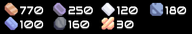
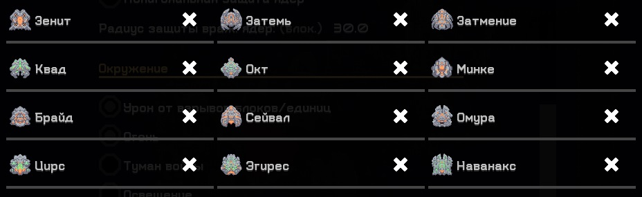
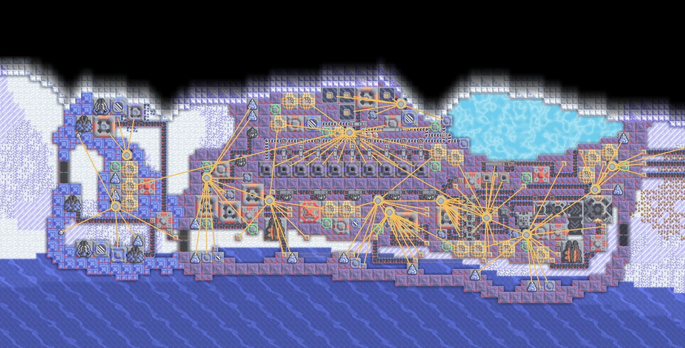
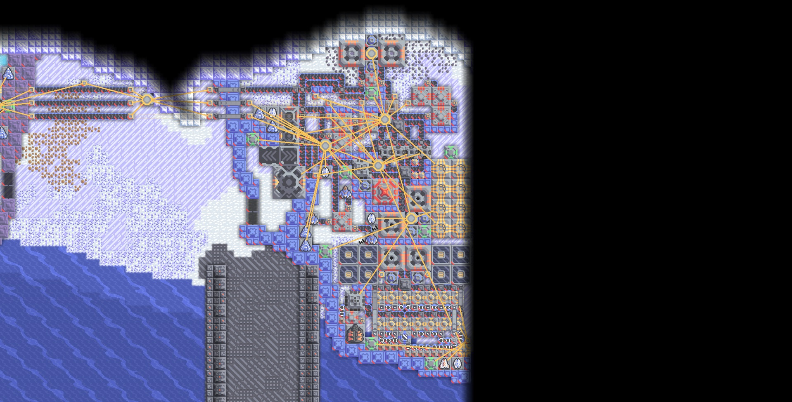
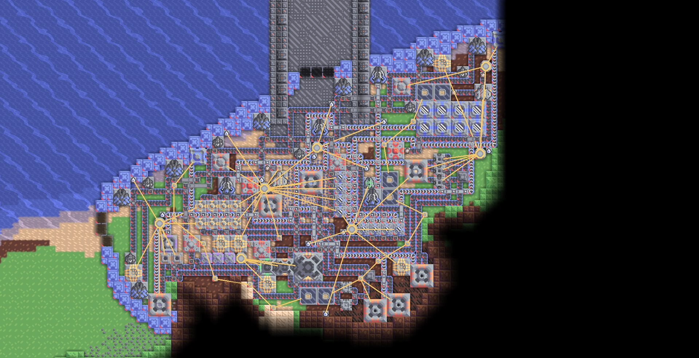
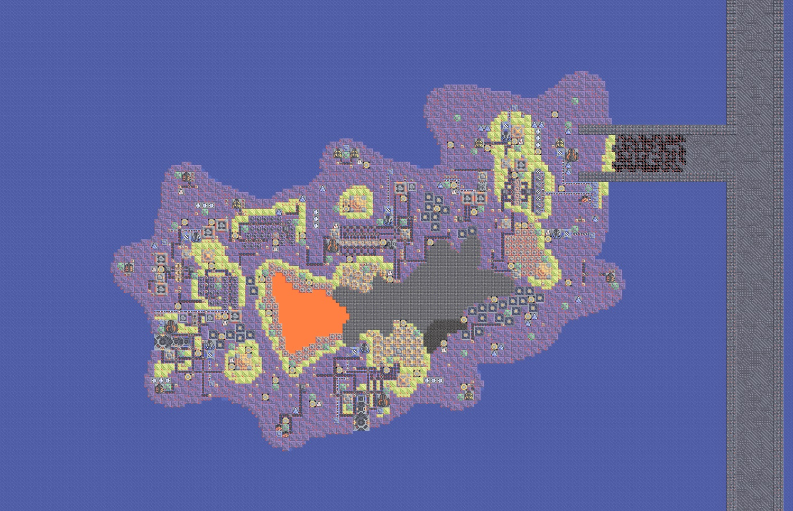
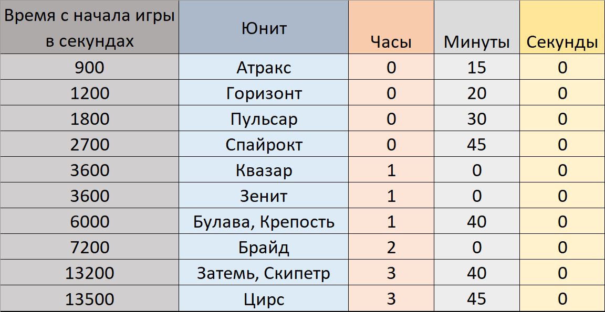

# Знакомство с картой

- Чтобы получить последнюю версию карты, нужно перейти в раздел **[Releases](https://github.com/Exateym/Siberia-and-Greece/releases)**, найти последний релиз и скачать оттуда файл *siberia_and_greece.msav*.

## Описание

- Карта **Siberia and Greece** была разработана для игрового режима **Атака**. Такое специфичной название было выбрано из-за особенностей ландшафта, который тематически разделён на холодную северную часть и тёплую южную. По задумке игроков отправляют на миссию по зачистке сектора от вражеских баз конкурентов. Чтобы победить, придётся не только идти в наступление, но и отстраивать оборону. Противникам уже известно о присутствии игроков. Чем больше проходит времени с момента старта игры, тем больше будет активировано фабрик и реконструкторов на базах конкурентов.

## Особенности

- Контроль миссии будет оповещать игроков о возможном появлении новых нападающих юнитов.

- Команде игроков прилагаются стартовые ресурсы для уверенного начала игры и организации производств.

- Прохождение столь большой карты **занимает много времени**. Приблизительно, для достижения победы уйдёт около 5 часов.

- При многократном тестировании карты стало ясно, что надо ограничить игроков возможностью создавать всех юнитов. Было решено запретить почти все виды кораблей и почти все летательные машины. Игрокам предлагается проходить карту, используя наземных юнитов.

## Локализация

- Изначально все текстовые сообщения, которые выводились во время геймплея были написаны на английском языке. Не всем удобно и понятно читать так, поэтому была создана возможность смены на русскую локализацию. Поменять язык сообщений можно сверху от ядра игроков.

# Подробная информация о противниках

- На карте присутствует 5 вражеских баз. Захват баз гарантирует новые территории под застройку и новые источники ресурсов. Каждая база была продумана, чтобы отличаться чем-нибудь от остальных.

## Фабрика кошмаров

- Эта база является самой близкой к ядру игроков. Она имеет три ядра. Здесь производятся юниты *Атракс* и *Спайрокт*. Уничтожив самое левое ядро, можно получить доступ к добыче титана. Важными ресурсами этой базы также являются торий и озеро с криогенной жидкостью. После захвата территории здесь удобно размещать ториевые реакторы.

## Последний рубеж

- Несмотря на своё название, это одна из самых простых баз для уничтожения и захвата. На базе всего одно ядро. Вся электроэнергетика поддерживается паровыми генераторами, работающими на угле. Если поджечь что-то на базе, последствия будут масштабными. Эта база не является самостоятельной и получает ресурсы от соседней базы. Здесь выпускаются юниты *Пульсар* и *Квазар*. Производство этих юнитов можно легко прервать, разрушив линии конвейеров между базами.

## Криогенная крепость

- Название этой базы полностью оправдано. Здесь производится большое количество криогенной жидкости, которая будет использоваться против интервентов. На базе ведётся масштабная добыча титана, который заряжается в терели *Взрыватель*. Также здесь производится метастекло и кремний, используемые в пушках *Рассеиватель* и *Град*. В отличие от других баз, на этой нет ремонтных станций — их функции выполняют юниты *Мега*. Три процессора управляют их поведением. Первый не позволяет юнитам покинуть территорию базы. Второй заставляет юнитов чинить повреждённые строения на базе. Третий контролирует здоровье юнитов и отправляет их на ремонтную турель, если они получили повреждения.

## Вулканический остров

- Это самая большая и укреплённая база на карте. Электричество здесь вырабатывается в больших количествах благодаря термальным генераторам. База оснащена мощными защитными турелями, которые используют взрывчатую смесь в качестве боеприпасов. По всей территории расположены ремонтные проекторы и защитные башни *Сегмент*. Все силовые проекторы дополнительно охлаждаются водой и снабжаются фазовой тканью. Здесь производятся опасные корабельные юниты *Брайд* и *Цирс*. Лучшей тактикой перед нападением будет разрушение производства взрывчатой смеси.

## Нерушимая цитадель

- По задумке нападать на данную базу следует в последнюю очередь. Сломать здесь всё просто так не выйдет. Из особенностей стоит отметить производство кинетического сплава для рельсотрона *Знамение*. Здесь находится реконструктор четвёртого ранга, создающий мощных юнитов *Затемь* и *Скипетр*. До выхода сильнейших юнитов производятся *Горизонт*, *Зенит*, *Булава* и *Крепость*.

## Время появления новых врагов

## Уведомления о вторжении

# Обращение от автора

- Если вам интересно знать, как устроены такие особенности карты, как смена локализации, счётчик оставшихся ядер противника, счётчик времени, уведомления о наступлении новых врагов, уникальное поведение юнита *Мега* и другое, вы можете поискать на карте процессоры, которые расположены как минимум на каждой базе и разобраться зачем нужен каждый из них.

- Под конец хочу сказать, что при разработке карты была проделана масштабная работа: было потрачено очень много времени и сил. Карта начала своё развитие ещё в конце декабря 2022 года. Разработка неоднократно забрасывалась, но была доведена до конца в начале сентября 2024 года. За это время было проведено множество проверок геймплея карты на разных этапах её развития. Всю карту и отчёты по проделанной работе были сделаны лично мной, а тестирования проходили с друзьями. **Надеюсь, вам понравится моя карта и вы будете довольны проведённым временем!**